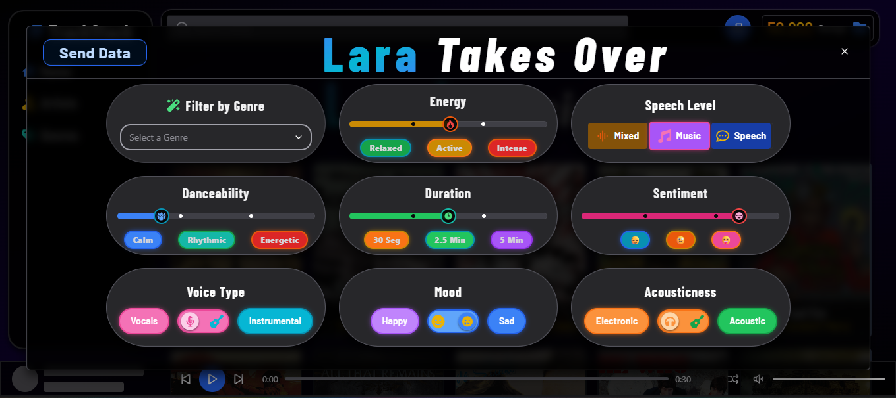
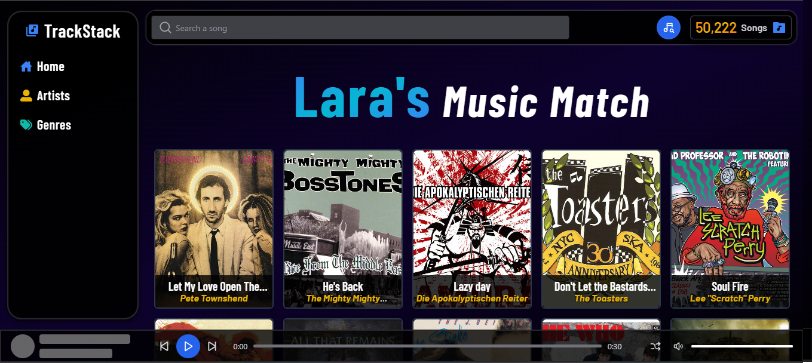

# 🎵 TrackStack

TrackStack is a project I created for 2 reasons.

1. **To showcase my skills** that I've gained throughout my programming journey, to have a way to put into practice and present the knowledge I've built in this newfound **passion** for coding and software design. That's why I set out to build a large-scale project that would truly challenge my abilities: a smooth, responsive Frontend where users can listen to song previews that spark their interests, paired with a well-typed, efficient Backend that delivers requests as quickly and reliably as possible.

2. **To help people discover new songs**. The API features a database of over **50,000 songs**, where users can search and explore new tracks, and, if they like what they hear, jump straight to Spotify to enjoy the full version!. 
 
Do you like artists such as **Linkin Park**, **Shakira**, or **Eminem**? 

With this optimized search system, powered by ElasticSearch and its fuzzy search technology, you can quickly and accurately find the artists, songs, and albums you want from all the available options:

    

Explore over **100 genres** and find your next favorite song based on your tastes!

    

 
This project also includes a song recommendation system, with which you can get up to **40 personalized songs** based on your preferences!

Just enter your tastes in this modal, which you can find by clicking on the button with the music icon:

    

After that, just press the Send button, and in a matter of seconds you will be automatically redirected to a page showing your search results:

    

To deliver the best possible user experience, I combined modern technologies: **ElasticSearch** for lightning-fast searches, **React** with **React Router DOM** and **Chakra UI** for a responsive and smooth interface, all powered by a **NestJS** backend with **GraphQL** to handle requests for songs, artists, genres and albums efficiently. 

All of this delivered via a **CI/CD pipeline** that automates Jest unit tests, end-to-end testing, rutinal health check and deployment, ensuring continuous performance, reliability, and seamless delivery of new API versions.

You can check out the live version in the link below:

🔗 **[Live Project](https://trackstack-c9rh.onrender.com/)**

 
    

---

## 🖥️ FrontEnd Technologies
- ⚛ **React**: Main library used for building the frontend, specialized in creating Single Page Application (SPA) to deliver a fast, responsive, and efficient user experience.

- 🔄 **GraphQL (Apollo Client)**: Handles GraphQL queries, sending requests to the Backend and managing the returned data efficiently.

- 🎨 **Chakra UI React**: Component Library that integrates seamlessly with React, offering a reusable and accesible design system to speed up development and improve user experience. 

- 🗺 **React Router DOM**: Enables routing in a SPA, combining the speed of client-side rendering with familiar URL-based navigaiton.

- 📦 **Redux**: State management toolkit that allows sharing and updating specific pieces of data across multiple components, improving scalability and maintainability.

---

## BackEnd Techonologies
- 🚀 **NestJS**: Primary framework used to build a modular, scalable, and maintainable backend architecture.

- 🔄 **Apollo Server (GraphQL)**: Handles the client requests using the GraphQL query language, enabling flexible and efficient data fetching.

- 💽 **Sequelize**: An Object-Relational Mapping (ORM) for managing relational data models and interacting with the PostgreSQL database in a structured way. It retrieves dozens of songs, artists and albums in seconds, and by using a randomly generated seed in queries, delivers semi-random results that keep the experience fresh, letting users discover a new song or artist every time they visit.

- 🗄 **PostgreSQL**: Primary Database, storing over **300k records** with high reliability and performance. 

- ⚡ **ElasticSearch**: High-performance search engine used to execute complex queries, with over **30k indexed documents** for lightning-fast retrieval. Designed to be flexible, being able to return the exact song, artist or album that you're looking for, or provide approximate matches by doing a **fuzzy search**, **n-grams**, and **edge-ngrams**, offering users a fast and modern search experience.

- 🧪 **Jest**: A robust testing framework used to verify that services, resolvers and core API functions behave exactly as expected through unit and integration tests. With **196 automated tests**, it covers everything from standard data flows to edge cases and error handling, ensuring the Backend remains reliable even under unexpected conditions to maintain a smooth user experience. 

Thanks to this coverage, the codebase consistently delivers over **90% statement coverage** and strong metrics in every category, a clear sign of a well-tested and production-ready system:

    

These tests run automatically in the **CI/CD pipeline**, ensuring that every feature or change is validated before deployment - keeping the API stable, performant and ready for production at all times.

## 📜 Typescript
A superset of Javascript with static typing, helping catch errors early and making the codebase more reliable and easier to maintain. In this project, over **25 custom verification and parsing functions** streghthen data handling, ensuring that any incoming variable is validated and processed correctly - resulting in a smooth, predictable and robust codebase.

## 🧩 End-to-End Tests
- 🎭 **Playwright**: Runs in the **CI/CD pipeline** to simulates real user workflows across multiple browsers, ensuring seamless and consistent communication between the Frontend and Backend in different environments. The tests cover navigation, UI interaction, and visual checks to confirm that the API responds as expected.
