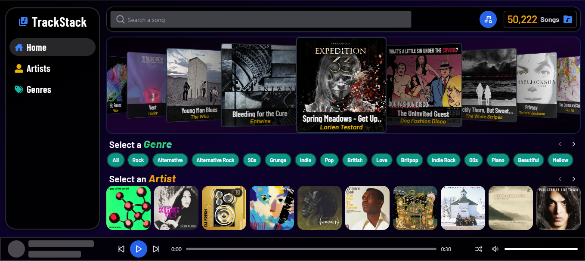
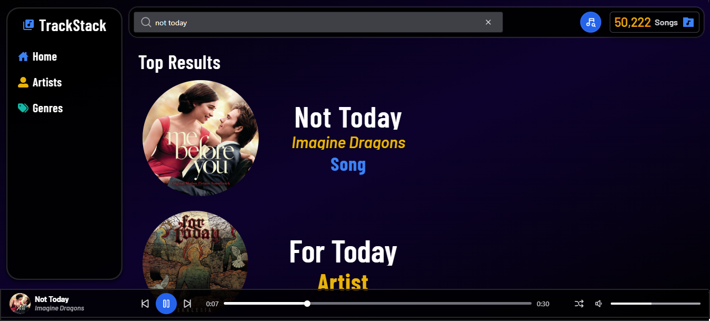
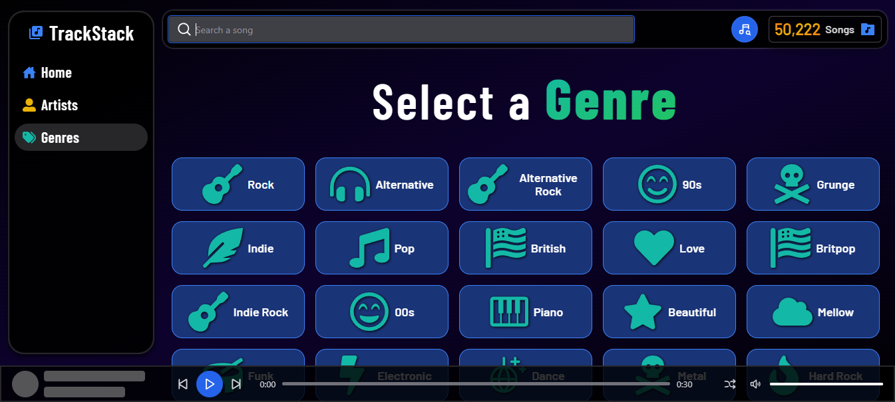
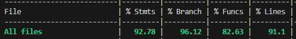

# 🎵 TrackStack

Do you want to find a new banger song? Try out this music recommendation web app that uses an algorithm based on song metadata (genre, energy, danceability, and more) to recommend tracks based on the parameters you choose. Discover new songs from a database of over 50,000 tracks!

Check out the live version in Render:

🔗 **[Live Project](https://trackstack-c9rh.onrender.com/)**

<p align="center"> 
    
</p>

---

## Description

To deliver the best possible user experience, I combined several modern technologies: **ElasticSearch** for lightning-fast searches, **React** with **React Router DOM** and **Chakra UI** for a responsive and smooth interface, all powered by a **NestJS** backend with **GraphQL** to handle requests for songs, artists, genres and albums efficiently. 

All of this delivered via a **CI/CD pipeline** that automates Jest unit tests, end-to-end testing, routine health checks, and deployment, ensuring continuous performance, reliability, and seamless delivery of new API versions.

---

## Motivation

Music has always been a vital part of my life, accompanying me when I am happy, sad, or when I just want to relax. It is a wonderful companion that has been helping me throughout my life. However, when I want to discover new songs from a specific genre to expand my horizons, It's really difficult to find a song that matches the mood you're in. For that reason, I realized a solution to this problem would be an advanced song recommender that can suggest songs that suits what you want to listen according to a set of parameters.

I built this projet for two main reasons:  

1. **To showcase my skills** that I've gained throughout my programming journey, to have a way to put into practice and present the knowledge I've built in this newfound **passion** for coding and software design. That's why I set out to build a large-scale project that would truly challenge my abilities: a smooth, responsive Frontend where users can listen to song previews that spark their interests, paired with a well-typed, efficient Backend that delivers requests as quickly and reliably as possible.

2. **To help people discover new songs**, this API features a database of over **50,000 songs**, where users can search and explore new tracks, and, if they like what they hear, jump straight to Spotify to enjoy the full version!

---

## 🚀 Quick Start

1. Navigate to [TrackStack.com](https://trackstack-c9rh.onrender.com/).
2. Click the **beam note button** in the top right corner to open the recommendation modal.
3. Set your preferences: choose from over **100 genres** and adjust different parameters like energy, danceability, sentiment, mood, among others to your liking.
4. Ready to go? Click the **Send Data** button and in you'll be redirected to your personalized recommendations in just seconds!
5. Want to check them out? Just hover over any song and click the play button to hear a 30-second preview.

**That's it!** Now you can discover new bangers tailored to your tastes.

---

## 📖 Usage

### Track new songs based on your preferences

Want to find a new banger?

1. Open the recommendation modal by clicking the **Beam Note** button in the top navbar.
2. Adjust your preferences using the sliders, switches and input search to modify the parameters (e.g. mood, energy, danceability, etc.) according to your tastes.
3. Press the **Send Data** button to submit your request. 

In a few seconds you'll be redirected to a page showing songs that match your preferences:

<p align="center">
    
</p>

<p align="center">
    
</p>

### Track a song, an artist or an album

To search for a specific song, artist, or album, use the search bar in the top navbar and type what you are looking for. The system will load several results that try to match your query. The search is powered by ElasticSearch and its fuzzy search capabilities, using features like **fuzzy search**, **n-grams**, and **edge-ngrams** to increase recall and tolerate typos. Search across more than **28,000** results available to find the specific song you are looking for, as shown in the image below:

<p align="center">
    
</p>

### Check out the tracks

What's a good recommendation system if you can't listen to the tracks it suggests?

1. Hover over the image of the song you want to check out.
2. Click the play button.

A 30-second song-preview will be played automatically. At the bottom of the page, you can see more information about the currently playing track, such as its elapsed time and artists. The player also includes extra controls, like a button to play a random song, buttons to play the previous and next tracks by ID, and a slider to control the volume:

<p align="center">
    
</p>

### Learn more about a track

Want to know more about a specific song that caught your eye?

1. Click the title of the song (the text in white).

You'll be redirected to a page that shows additional information about the track, including its genres, duration, release date, album, and even a link to Spotify if you want to hear the full version:

<p align="center">
    
</p>

### Discover songs by artists

Do you want to discover new artists? 

1. Click the **Artists** section in the left sidebar. 
2. Click on the image of any artist that catches your attention.

You'll be redirected to a page where you can listen to their songs:

<p align="center">
    
</p>

<p align="center">
    
</p>

### Discover songs by genre

Explore over **100 genres** and find your next favorite song based on your tastes. 

1. Click the **Genres** section in the left sidebar to open the genres page. 
2. Select the song genre you want to hear.

<p align="center">
    
</p>

---

## 🖥️ Frontend Technologies
- **React**: Main library used for building the frontend, specialized in creating Single Page Application (SPA) to deliver a fast, responsive, and efficient user experience.

- **GraphQL (Apollo Client)**: Handles GraphQL queries, sending requests to the Backend and managing the returned data efficiently.

- **Chakra UI React**: Component Library that integrates seamlessly with React, offering a reusable and accessible design system to speed up development and improve user experience. 

- **React Router DOM**: Enables routing in a SPA, combining the speed of client-side rendering with familiar URL-based navigation.

- **Redux**: State management toolkit that allows sharing and updating specific pieces of data across multiple components, improving scalability and maintainability.

---

## Backend Technologies
- **NestJS**: Primary framework used to build a modular, scalable, and maintainable backend architecture.

- **Apollo Server (GraphQL)**: Handles the client requests using the GraphQL query language, enabling flexible and efficient data fetching.

- **Sequelize**: An Object-Relational Mapping (ORM) for managing relational data models and interacting with the PostgreSQL database in a structured way. It retrieves dozens of songs, artists and albums in seconds, and by using a randomly generated seed in queries, delivers semi-random results that keep the experience fresh, letting users discover a new song or artist every time they visit.

- **PostgreSQL**: Primary Database, storing over **300k records** with high reliability and performance. 

- **ElasticSearch**: High-performance search engine used to execute complex queries, with over **30k indexed documents** for lightning-fast retrieval. Designed to be flexible, being able to return the exact song, artist or album that you're looking for, or provide approximate matches by doing a **fuzzy search**, **n-grams**, and **edge-ngrams**, offering users a fast and modern search experience.

- **Jest**: A robust testing framework used to verify that services, resolvers and core API functions behave exactly as expected through unit and integration tests. With **196 automated tests**, it covers everything from standard data flows to edge cases and error handling, ensuring the Backend remains reliable even under unexpected conditions to maintain a smooth user experience. 

Thanks to this coverage, the codebase consistently delivers over **90% statement coverage** and strong metrics in every category, a clear sign of a well-tested and production-ready system:

<p align="center">
    
</p>

These tests run automatically in the **CI/CD pipeline**, ensuring that every feature or change is validated before deployment - keeping the API stable, performant and ready for production at all times.

## 📜 TypeScript
A superset of JavaScript with static typing, helping catch errors early and making the codebase more reliable and easier to maintain. In this project, over **25 custom verification and parsing functions** strenghthen data handling, ensuring that any incoming variable is validated and processed correctly - resulting in a smooth, predictable and robust codebase.

## 🧩 End-to-End Tests
- **Playwright**: Runs in the **CI/CD pipeline** to simulate real user workflows across multiple browsers, ensuring seamless and consistent communication between the Frontend and Backend in different environments. The tests cover navigation, UI interaction, and visual checks to confirm that the API responds as expected.

## 🤝 Contributing

### Clone the repo

```bash
git clone https://github.com/Raghart/TrackStack.git
cd TrackStack
```

### Install Frontend dependencies

```bash
cd front
npm install
```

### Install Backend dependencies

```bash
cd ../back
npm install
```

### Setup the required .env variables

In a .env file, setup all of your database information using these names: **DB_USERNAME**, **DB_PASSWORD**, **DB_HOST**, **DB_NAME**, **DB_PORT**.

To setup the ElasticSearch service, setup your link using the next variable name: **ELASTICSEARCH_NODE**.

Finally, if you want the build to run in a different Port make sure to setup the variable: **PORT**.

### Run the web app locally from the back directory

Keep in mind that running the app locally requires all the **.env** variables from the previous step to connect to the external service that provide the data shown to the users:

```bash
npm run dev
```
